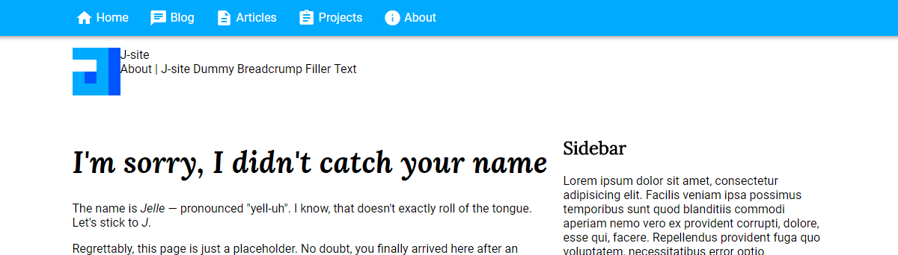
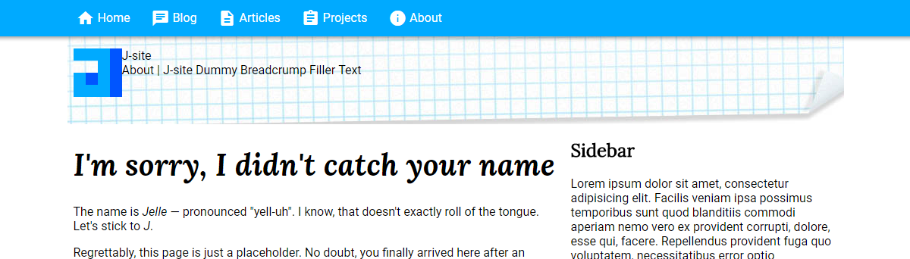
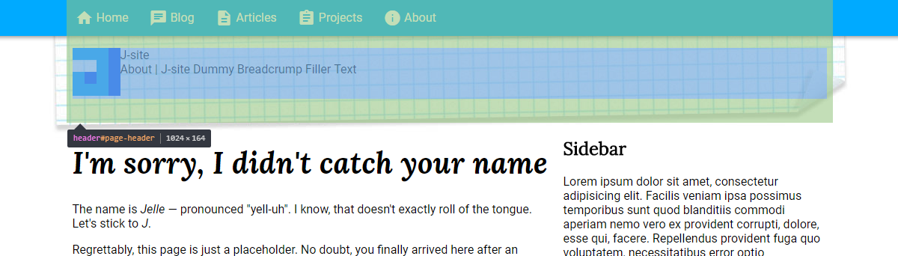
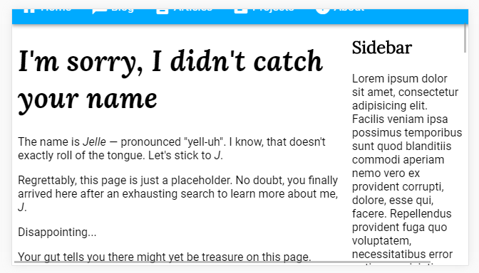
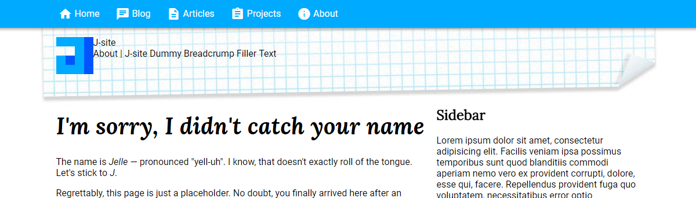

## Y'all got any graph paper?

I did something interesting yesterday. Let me sketch the situation for you. I want to add something organic to my header to make it more personal. I've decided I'd put a graph paper background behind it. Easy peasy! Here's a before and after of the extreme makeover. 

Ew, gross! The edges are all chopped off. If you're into HTML to any extent at all, you probably know what's happening. I slapped the background on my header div. That div however, is limited in size. Now, while content can overflow outside of a div's boundaries, backgrounds can not. Turns, out I want my background to be slightly bigger than the div, to make everything feel a little more organic. 

So backgrounds can't overflow... I comb through my drawer and take out a pair of dark sunglasses with a label glued onto it: _"Dirty Hax Glasses"_. 

Challenge. Accepted.

As I flip through the pages of my CSS hacks sorcery book, I come across the good ol' _Marginus Negativus_ spell. As even apprentice wizards know, hooking up a div with negative margins can resolve many-a-problem. I sprinkle some padding back on to realign the content and _voila_! Problem solved. I perform a quick, obligatory check on mobile and everything looks... broken. As to be expected when using hacks, you fix one problem and create two new ones. 

Turns out mobile devices don't really like negative margins. The negative margins are causing the layout to be bigger than the screen size, as witnessed by the horizontal scrollbars appearing. Because of this, scrolling up partially obscures the navigation bar, due to the viewport shifting down. While this could be a cool effect for hiding the navigation bar of your site when scrolling down, it's not what we want here. I spent the rest of the evening figuring out where I could add negative margins without affecting the layout. A couple of extra containers here, some magic numbers there. Alas. 

## On boxes and bending spacetime

Why is this interesting? Well let me paint an analogy here. I've got this big stack of cardboard boxes in my room. Sturdy boxes and weak boxes, big boxes and small boxes, labeled boxes and plain ones. Even a small dodecahedronical box, you never know... I brought them because I'm moving houses, and need to transport my stuff. Now in the corner of the room, I have a sculpture of a snake. More specifically, a snake that ate an elephant, hence, a fairly big sculpture. I take out my label maker and enter _"Snake that ate elephant"_. I hit the _Print_ button and bzzzt, a beautiful label leaves the machine. I make sure to cleanly align the label with the box edge, in accordance with the moving company's guidelines, and affix it. A masterpiece, if I may say so myself. 

I look at the box, then stare at the sculpture. Back to the box, and back to the sculpture. How can I fit this clumsily big statue in this tiny box... I contemplate: "Why would they make boxes so small, they can't even contain a sculpture of a snake that ate an elephant". My engineering sense starts tickling. Perhaps I could carefully break up the sculpture into smaller pieces, and glue them back together at home?`... A no-go, it would leave visible seams on the statue. 

Time for the classic approach. I pick up the statue and hold it in front of the box. I close my right eye and start furiously rotating the statue in every possible angle, only to confirm that — yes, there is no way this thing will fit inside the box as a whole. I scramble for the drawer and take out my trusty _Dirty Hax Glasses_. Then it struck me — of course! I jostle through the mess of boxes to reach my other drawer, and take out my physics textbook, from back at university. Unsure where to start, I check the index for _general relativity_. After a thirty-minute reading session, I come up with nothing. Time to head over to the [Physics Stack Exchange](https://physics.stackexchange.com/). "Ask a question", it is. 

> "Hi guys, I have a question on spacetime. Specifically, how can I bend spacetime to make the inside of a box larger than its outside?"

It's getting late, so I decide to go to bed while the physics magicians solve my moving problem. As I get up in the morning my eye falls on an empty, bigger box. 

## The day after

If you catch yourself hacking away at a scripting/programming project, and notice a [peculiar smell](https://en.wikipedia.org/wiki/Code_smell), consider whether you are solving the right problem. Oftentimes, having to bend and twist a programming language to fit your problem, means _the problem is the problem_. 

Sometimes you'll be completely in the zone when working on a project, and you'll make decisions without even realizing you made them. When things goes awry, take a step back and look at the broader picture. Do I have to put this big sculpture in the tiny box, or can I just use the bigger box? Do I have to put this big background in this tiny div, or can I just slap it on a bigger parent element?

As I woke up the day after, my eye fell on the majestic _body_ element. Unrivaled in size, capable of withstanding the most giant of images. And all was well that day. 

